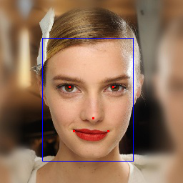
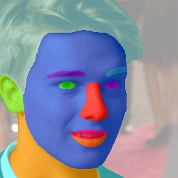

# facetools
Easy-to-use face related tools, including face detection, landmark localization, alignment &amp; recognition, based on **PyTorch**.

## Quick start
* **Do face detection and landmark localization  using MTCNN**
```python
from PIL import Image
from align.detector import detect_faces
from align.visualization_utils import show_results

img = Image.open('imgs/single.jpg')  # modify the image path to yours
bounding_boxes, landmarks = detect_faces(img)  # detect bboxes and landmarks for all faces in the image
show_results(img, bounding_boxes, landmarks)  # visualize the results
```
   

* **Do alignment**
```python
from align.face_align import align
res = align('imgs/single.jpg', save_path='./result', vis=False)
res.show()
```


* **Do face encoding using IR50 model** ([download pretrained model](https://pan.baidu.com/s/1L8yOF1oZf6JHfeY9iN59Mg#list/path=%2F))
```python
from PIL import Image
from util.extract_feature import extract_feature
from backbone.model_irse import IR_50

image_1 = Image.open('imgs/align.jpg')  # modify the image path to yours

model = IR_50([112, 112])
model_cp = 'checkpoint/backbone_ir50_ms1m_epoch120.pth'

features = extract_feature(image_1, model, model_cp)
print(features.size())  # output : torch.Size([1, 512])

```

* **Calculate the distance between two images**
```python
import numpy as np
from PIL import Image
from util.extract_feature import extract_feature
from backbone.model_irse import IR_50
from scipy.spatial.distance import pdist


face_1 = Image.open('imgs/person_1/17.jpg')
face_2 = Image.open('imgs/person_1/18.jpg')  # face_1 and face_2 belong to the same one

face_3 = Image.open('imgs/person_2/151.jpg')
face_4 = Image.open('imgs/person_2/152.jpg')  # face_3 and face_4 belong to the same one

model = IR_50([112, 112])
model_cp = 'checkpoint/backbone_ir50_ms1m_epoch120.pth'

data = [face_1, face_2, face_3, face_4]

features = extract_feature(data, model, model_cp)
features = [i.numpy() for i in features]  # embeddings for face_1, face_2, face_3 and face_4

diff = np.subtract(features[0], features[1])
dist = np.sum(np.square(diff), 1)
print(dist)  # output : 1984.6016

diff = np.subtract(features[2], features[3])
dist = np.sum(np.square(diff), 1)
print(dist)  # output : 1921.2222

diff = np.subtract(features[0], features[2])
dist = np.sum(np.square(diff), 1)
print(dist)  # output : 16876.32

diff = np.subtract(features[1], features[3])
dist = np.sum(np.square(diff), 1)
print(dist)  # output : 17107.396

dist = pdist(np.vstack([features[0], features[1]]), 'cosine')
print(dist)  # output : 0.12932935

dist = pdist(np.vstack([features[2], features[3]]), 'cosine')
print(dist)  # output : 0.11706942

dist = pdist(np.vstack([features[0], features[2]]), 'cosine')
print(dist)  # output : 1.09022914

dist = pdist(np.vstack([features[1], features[3]]), 'cosine')
print(dist)  # output : 1.07447068
```

* **Do face parsing**
```python
from PIL import Image
from parsing.face_parsing import parsing, vis_parsing_maps

image = Image.open('imgs/9.jpg')

res = parsing(image)
vis_parsing_maps(image, res, show=True, save_im=True)
```
 

### Using facetools in Your Project
It is easy to use facetools in your project.
```
Your project
│   README.md
│   ...
│   foo.py
│
└───facetools
│
└───directory1
│   
└───...
```

In `foo.py`, you can easily import facetools by adding:
```python
from facetools import detect_faces, show_results
from PIL import Image

def foo():
    img = Image.open('/path/to/your/image') 
    bounding_boxes, landmarks = detect_faces(img) 
    show_results(img, bounding_boxes, landmarks) 
```

## Acknowledgement
- This repo is based on [face.evoLVe.PyTorch](https://github.com/ZhaoJ9014/face.evoLVe.PyTorch) and [face-parsing.PyTorch](https://github.com/zllrunning/face-parsing.PyTorch). Many thanks to the excellent repo.


